# Challenge:
# Telecom X, parte 1: Análisis Exploratorio

Análisis de una base de datos comercial para la generación de _insights_.

<br>

## Escenario

Telecom X es una compañía con gran presencia en México y Latinoamérica. Ofrecen soluciones tecnológicas en telefonía, internet y servicios de _streaming_, incluyendo soporte técnico y protección a diversos dispositivos.

En los últimos tiempos, esta compañía ha observado un aumento en el abandono por parte de sus clientes (_churn_).
Nuestro trabajo consiste en analizar la base de datos de su clientela, con el fin de hallar algunos _insights_ que pudieran ayudar a determinar las causas del _churn_.

<br>

## Metodología

Se llevó a cabo el análisis y la posterior limpieza y ordenamiento de los datos provenientes de la base de clientes:

* Sexo y edad.
* Características familiares de los clientes: estado civil, dependientes, etc.
* Servicios contratados por los clientes: internet, telefonía, streaming, ciberseguridad.
* Tarifas pagadas por los clientes.
* Métodos de pago utilizados por los clientes.

<br>

## Limpieza y ordenamiento de los datos

### Paquetes necesarios

Para la ejecución del presente proyecto se recurrió a los siguientes paquetes de `python`:

```python
import json
import pandas as pd
import matplotlib.pyplot as plt
import numpy as np
```

Además, se añadió una línea adicional para conservar automáticamente el formato de presentación de algunas cantidades numéricas:

```python
pd.options.display.float_format = '{:,.2f}'.format
```

### Normalización de la base de datos

El archivo base que contiene la base de datos se normalizó de forma que aquellas columnas que contienen datos anidados se expandiera en diversas columnas adicionales. También se corrigió el formato de los títulos de las columnas para una mejor legibilidad:

```python
with open('data/TelecomX_Data.json','r') as f:
	clientes = pd.json_normalize(json.load(f))
clientes.columns = [col.replace(".","_").lower() for col in clientes.columns]
```

### Base de datos inicial

La base de datos inicial consta de un total de 7,267 registros con 21 columnas:

<div align='center'>

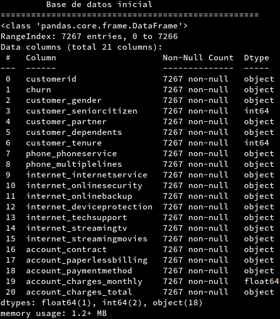

</div>

Se aprecia de la imagen anterior que una gran cantidad de las columnas muestra información cualitativa. Por ello, ha sido necesario llevar a cabo la limpieza y el ordenamiento de la base de datos. A continuación se detalla el procedimiento seguido para lograrlo.

### Clientes con registro de abandono no especificado

Del total de registros, se hallaron 224 cuyo estado de _churn_ es desconocido (i.e., no especifica `'Yes'` o `'No'`, sino simplemente un espacio en blanco). Se compararon algunos datos demográficos y de clientela entre el total de los clientes en este estado versus los clientes que sí tienen un estado de _churn_ específico.

<div align='center'>

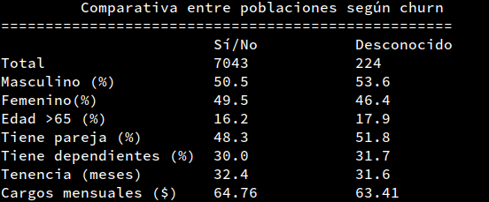

</div>

Al hallar que la tendencia en todos los datos enlistados en la imagen anterior no supone una diferencia apreciable (una máxima diferencia porcentual de 3.5%), se decidió eliminar todos los registros con estado de _churn_ no especificado, quedando un total de 7,043 clientes.

### ID de cada cliente

El código de identificación de cada cliente en la columna `customerid` es simplemente un registro interno para la compañía. Al no ser útil para el objeto del presente estudio, esta columna se eliminó por completo.

### Columnas con datos binarios

Las columnas `churn`, `customer_gender`, `customer_seniorcitizen`, `customer_partner`, `customer_dependents`, `phone_phoneservice` y `account_paperlessbilling` se componen en su totalidad de registros de tipo binario (`'Yes'/'No'`, `'Male'/'Female'`, etc.), se realizó un mapeo vectorizado de cada una de estas columnas con el fin de convertir los registros a un formato numérico, siguiendo el esquema que se muestra en la siguiente tabla:

<div align='center'>

|Tipo de dato original|Dato binario|
|:----:|:------:|
|`'Yes'`, `'Male'`|`1`|
|`'No'`, `'Female'`|`0`|

</div>

### Columnas con datos ternarios

Las columnas `phone_multiplelines`, `internet_onlinesecurity`, `internet_onlinebackup`, `internet_deviceprotection`, `internet_techsupport`, `internet_streamingtv` e `internet_streamingmovies` contienen datos ternarios (`'Yes'`, `'No'` y `'No service'`). Para efectuar el ordenamiento de estas columnas, se siguió con un aspecto lógico:
* Si un cliente no cuenta con servicio telefónico, es imposible que cuente con varias líneas.
* Si un cliente no cuenta con servicio de internet, resulta evidente que no ha contratado ningún servicio relativo a éste: resguardo y seguridad en la nube, protección de dispositivos, soporte técnico ni servicios de _streaming_.

Para estas columnas también se llevó a cabo un mapeo para convertir los datos a un formato numérico, siguiendo el esquema que se muestra en la siguiente tabla:

<div align='center'>

|Tipo de dato original|Dato binario|
|:----:|:------:|
|`'Yes'`|`1`|
|`'No'`|`0`|
|`'No phone service'`|`0`|
|`'No internet service'`|`0`|

</div>

### Columnas categóricas

Específicamente la columna `internet_internetservice` tiene tres posibles respuestas: `'DSL'`, `'Fiber optic'` y `'No'`. Solamente una de estas respuestas puede ser convertida a un formato numérico, en tanto que las otras dos no. Siguiendo el razonamiento anterior,
* No es posible que un cliente tenga algún tipo de internet (DSL, fibra ópttica) si no cuenta con el servicio.

De esta forma, las columnas que contienen únicamente datos cualitativos (`internet_internetservice`, `account_contract` y `account_paymentmethod`) fueron separadas en igual número de columnas que datos únicos originales mediante técnicas de _feature encoding_, quedando de la siguente forma:

<div align='center'>

|Columna original|Datos únicos|Nuevas columnas|
|:----:|:------:|:----:|
|`internet_internetservice`|3|`internet_dsl`, `internet_fiberoptic`, `internet_noservice`|
|`account_contract`|3|`contract_1yr`, `contract_2yr`, `contract_monthly`|
|`account_paymentmethod`|4|`payment_credit`, `payment_echeck`, `payment_mailcheck`, `payment_transfer`|

</div>

### Columnas con datos numéricos

Las tres columnas restantes (`customer_tenure`, `account_charges_monthly` y `account_charges_total`) continen una cantidad de datos numéricos tan amplia como lo puede ser la extensión de la base de datos. Esto se debe a las características de cada cliente: tiempo de permanencia con la compañía, servicios incluidos en su contrato, tipo de contrato, pago mensual, etc., por lo que resulta imposible determinar una tarifa estándar mediante ingeniería inversa.

No obstante, el tipo de dato numérico de estas columnas debe ser distinto, ya que el tiempo de permanencia de los clientes, medido en meses, debe tratarse de un número entero, mientras que las columnas relacionadas con cantidades monetarias deberían verse reflejadas como números de coma flotante.

### Errores en los registros

Después de haber efectuado la limpieza de la base de datos, es importante verificar que ésta no contenga errores en sus registros, por ejemplo:
* Un cliente nuevo no tiene periodo de tenencia, y sin embargo ya ha realizado algún pago.
* Un cliente puede tener alguna permanencia, pero no haber efectuado ningún pago en todo ese tiempo.
* Un cliente puede no tener servicio de internet, pero estar registrado con DSL o fibra óptica, o contar con algún servicio relativo.
* Un cliente puede estar registrado con múltiple líneas, pero no contar con servicio telefónico.

Por lo tanto, se realizó una búsqueda exhaustiva de posibles errores en los registros en la base de datos y, de ser el caso, se tomó una decisión en cuanto a intentar reparar el registro (e.g., por iteración o interpolación), o eliminar dicho registro. Las siguientes tablas enlistan los errores encontrrados después del ordenamiento de la base de datos.

<div align='center'>

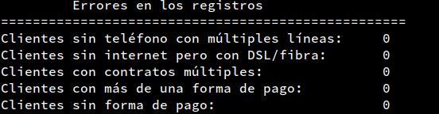
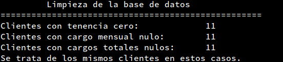

</div>

Cabe destacar que los 11 registros encontrados con tenencia o pagos nulos no fueron eliminados de la base de datos, sino que se reemplazó cualquier campo vacío con `0`, conservando el formato numérico correspondiente.

### Base de datos final

A continuación de muestra la información de la base de datos terminada.

<div align='center'>

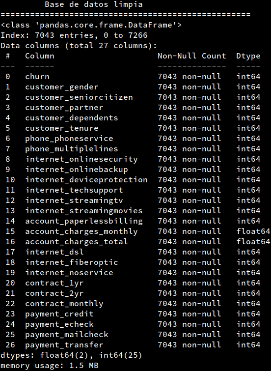

</div>

Esta base de datos fue resguardada como un nuevo archivo de valores separados por comas, para posteriormente ser analizado en el proyecto [**Telecom X, parte 2: Machine Learning**](https://github.com/jvalzert/challenge-telecomX-pt2)

```python
clientes.to_csv('data_TelecomX_clean.csv',index=False)
```

<br>

## Análisis exploratorio

### Clientes que abandonaron la compañía

Después del procedimiento de limpieza y ordenamiento de la base de datos, se cuenta con un total de 7,043 registros de los cuales se encuentra que el **26.5% de los clientes de Telecom X han abandonado la compañía**.

<div align='center'>


</div>

### Demografía de los clientes

Se llevó a cabo una primera exploración de las caraterísticas demográficas de los clientes en la base de datos. Los resultados se obervan muy similares con respecto al sexo de los clientes, incluso en su distribución de edades (cuya separación se estableció en 65 años de edad, indicada únicamente con la columna `customer_seniorcitizen`).

<div align='center'>

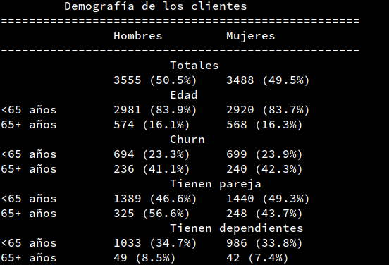

</div>

<div align='center'>


</div>

Asimismo, se analizó el porcentaje de clientes, divididos por sexo, que han abandonado la compañía:

</div>

<div align='center'>

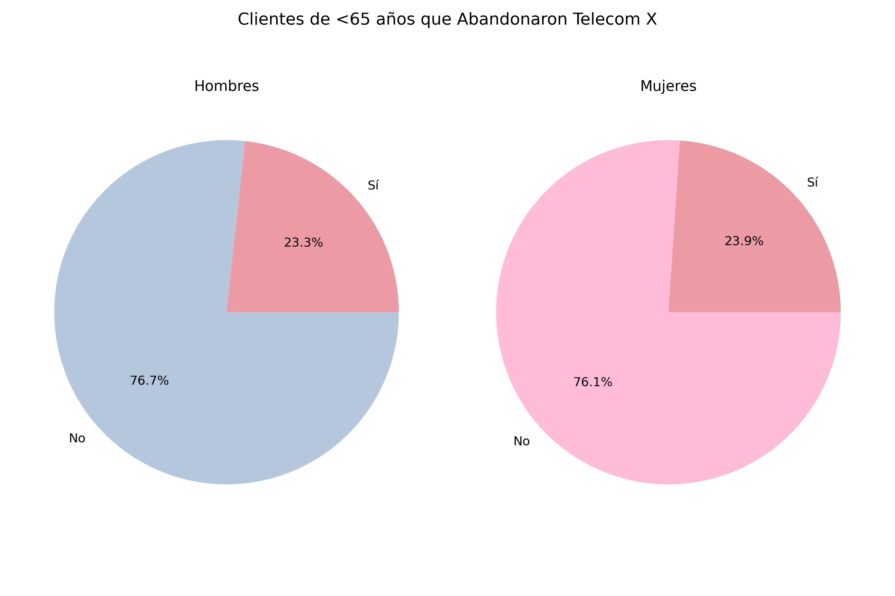
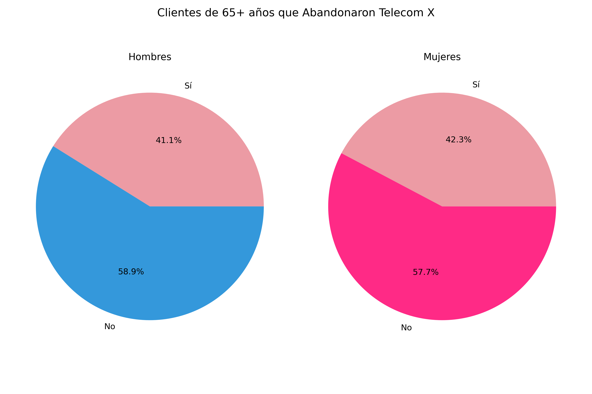

</div>

Como se puede observar, el porcentaje de clientes menores de 65 años que ha abandonado la compañía es esencialmente similar al total. Sin embargo, el porcentaje de adultos mayores de 65 años que ha abandonado la compañía es aproximadamente el doble. Esto implica que **los clientes de edad mayor son mucho más propensos a abandonar la compañía**.

A pesar de lo anterior, y toda vez que no se encuentran diferencias sensibles entre los clientes hombres y las clientes mujeres, el resto del presente estudio se realizó sin tomar en cuenta el sexo de los clientes.

### Características de los clientes que han abandonado

Este análisis continuó con una exploración de las características en los registros que están mayoremente relacionadas con el _churn_: tipos de contrato, pagos mensuales, servicios incluidos, etc. A continuación se muestran los resultados obtenidos de esta exploración.

<div align='center'>

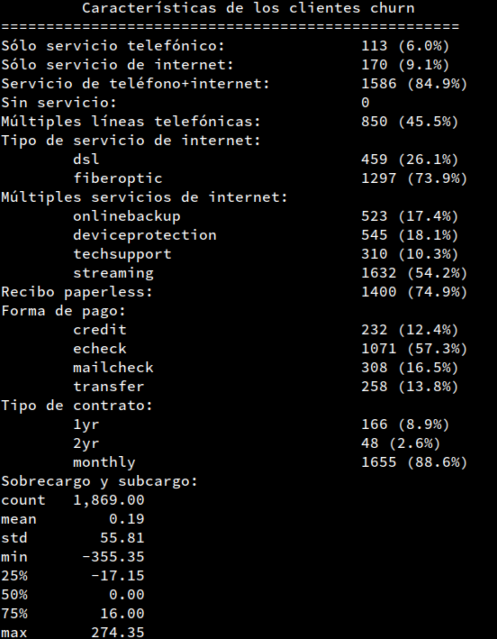

</div>

## Resultados

### Factores de riesgo

Gracias a la exploración anterior, se detectaron los siguientes **factores de riesgo de abandono**:

* **Cliente de edad mayor**.
* **Con servicio de teléfono+internet**.
* **Tiene múltiples líneas telefónicas**.
* **Tiene internet de fibra óptica**.
* **Utiliza servicios de _streaming_** (TV o películas).
* **Obtiene su recibo _paperless_**.
* **Paga con cheque electrónico**.
* **Su tipo de contrato es mensual**.

Estos factores de riesgo fueron estratificados de la siguiente forma:

<div align='center'>

|Factores|Nivel de riesgo|
|:----|:------:|
|0-1|Bajo|
|2-3|Medio|
|4+|Alto|

</div>

### Clientes fieles en riesgo de abandonar

Se llevó a cabo una búsqueda entre los clientes que permanecen fieles a la compañía y que en sus registros cuentan con estos factores de riesgo. Los resultados se observan a continuación.

<div align='center'>

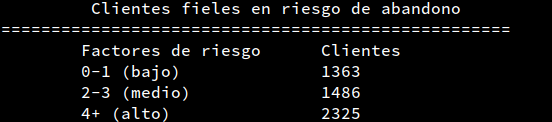
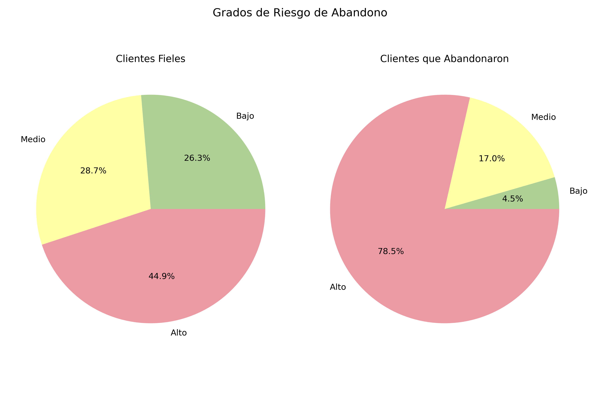

</div>


Para cada uno de estos factores, se debe de crear una estrategia adecuada para reduirlos o mitigarlos. **Estos , tal y como se puede apreciar de la gráfica a continuación, que detalla .


<br>

## Conclusiones

### Métrica clave

**El 44.9% de los clientes actuales tiene el mismo perfil que aquellos que ya abandonaron la compañía**.

### Estrategias de mitigación de riesgos

Dado que **los factores de riesgo arriba enlistados son muy sensibles entre los clientes que aún permanecen fieles con la compañía**, cada uno de ellos debe contar con su propia estrategia de _marketing_ enfocada en su mitigación, y deben tener como objetivo la retención de los clientes de Telecom X.

Algunas sugerencias de estrategias a seguir, son:

1. Contratos con planes especiales con descuentos para clientes de edad mayor.
2. Atención personalizada y enfocada en las necesidades de todos los clientes.
3. Beneficios adicionales por lealtad (p.ej., descuentos por pago anual o bianual anticipado).
4. Programas de capacitación y acompañamiento tecnológico.
5. Incentivar la domiciliación de tarjeta de crédito o transferencia electrónica.
