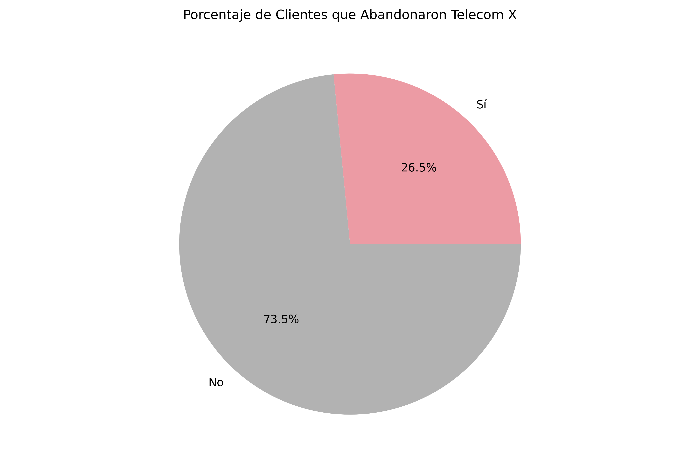
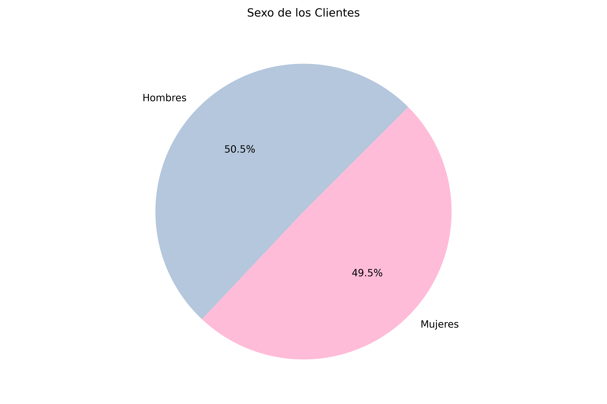
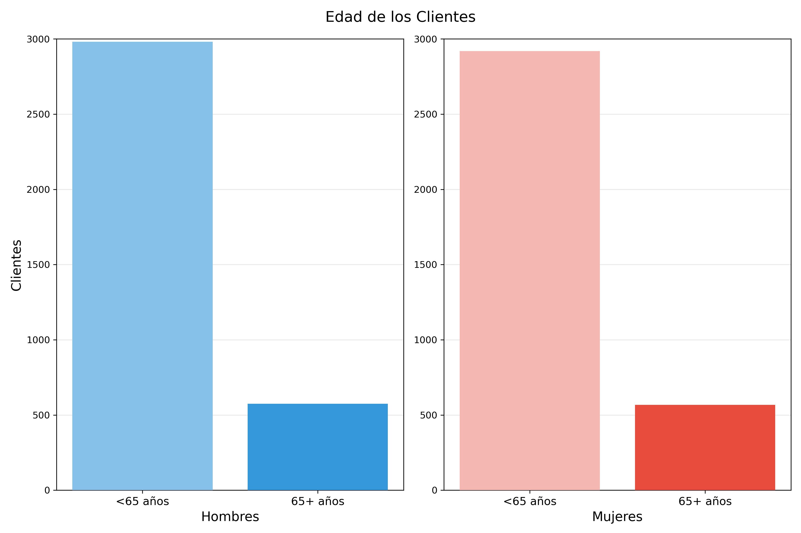

# Challenge:
# Telecom X, parte 1: Análisis Exploratorio

Análisis de datos comerciales para la toma de decisiones estratégicas.

 

## Escenario

Telecom X es una compañía con gran presencia en México y Latinoamérica. Ofrecen soluciones tecnológicas en telefonía, internet y servicios de streaming, incluyendo soporte técnico y ciberseguridad.

En los últimos tiempos, esta compañía ha observado un aumento en el abandono por parte de sus clientes (churn).
Nuestro trabajo consiste en analizar la base de datos de su clientela, con el fin de hallar algunos insights que pudieran ayudar a determinar las causas del churn.

 

## Metodología

Se llevó a cabo el análisis de los datos arrojados en la base de datos de clientes:

* Sexo y edad.
* Características familiares de los clientes: estado civil, dependientes, etc.
* Servicios contratados por los clientes: internet, telefonía, streaming, ciberseguridad.
* Tarifas pagadas por los clientes.
* Métodos de pago utilizados por los clientes.

 

## Resultados

### Totales

Se analizó un total de 7,264 clientes. De ellos, se encontró que 1,869 clientes abandonaron la compañía, mientras que otros 5,174 permanecen fieles.

Se encontraron además 224 clientes cuyo estado de churn es desconocido. Estos registros fueron analizados como una población separada de aquellos con estado de churn conocido (sí/no), con la finalidad de determinar los posibles impactos en la base de datos ante la decisión de eliminar dichos registros:

|     | Sí/No | Desconocido |
|:----|------:|------------:|
|Total|7,043|224|
|Masculinos (%)|50.5|53.6|
|Femeninos (%)|49.5|46.4|
|Edad >65 (%)|16.2|17.9|
|Tienen pareja (%)|48.3|51.8|
|Tienen dependientes (%)|30.0|31.7|
|Tenencia (meses)|32.4|31.6|
|Cargos mensuales ($)|64.76|63.41|

De la tabla anterior, se observa que la máxima diferencia entre porcentajes entre ambas poblaciones es de 3.5%. De esta forma, al tratarse de un 3.1% del total de la base de datos cuyas tendencias son esencialmente iguales a aquellas del resto, se decidió eliminar los registros con churn desconocido, quedando la base de datos con un total de 7,043 clientes.

### Clientes que han abandonado la compañía

Se observa que un 26.5% de los clientes han abandonado la compañía en los últimos tiempos, lo que constituye el objeto principal del presente estudio.

### Sexo y edad de los clientes

||Hombres|Mujeres|
|:---|:---:|:---:|
|<65 años|2,981|2,920|
|65+ años|574|568|

No se observa diferencia entre la población total de clientes hombres y mujeres, ni en la proporción de clientes mayores de 65 años en cualquiera de los sexos. No obstante, se encontró que el porcentaje de clientes mayores de 65 años que abandonaron la compañía es mucho mayor que aquel de clientes más jóvenes:

||Hombres|Mujeres|
|:---|:---:|:---:|
|<65 años|23.3|23.9|
|65+ años|41.1|42.3|

 

## Conclusiones

Después de llevar a cabo el análisis exploratorio, se encontró que las variables con mayor influencia en la decisión de abandono por parte de los clientes, son:

* Son adultos mayores.

 

## Recomendaciones

Con base en las conclusiones arriba enlistadas, a continuacións e sugieren algunas estrategias de retención.

1. Para clientes mayores de 65 años:
    * Planes especiales con descuentos para seniors.
    * Atención personalizada y enfocada.
    * Beneficios adicionales por lealtad.
    * Programas de entrenamiento y acompañamiento tecnológico.
